

<h1 align="center">Calm Shop</h1>

<h2 align="center"> An e-commerce store of books for mindful development</h2>

Live link: [Link](https://ecomm-screens.netlify.app/pages/products)

* All the screens are mobile responsive.

## Screenshots with Links

### [Addresses Page](https://ecomm-screens.netlify.app/pages/addresses.html)
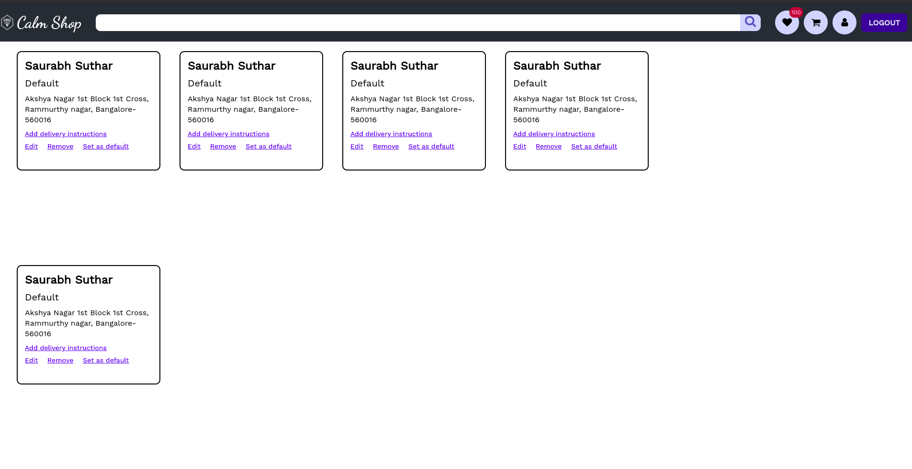

### [Cart Page](https://ecomm-screens.netlify.app/pages/cart.html)
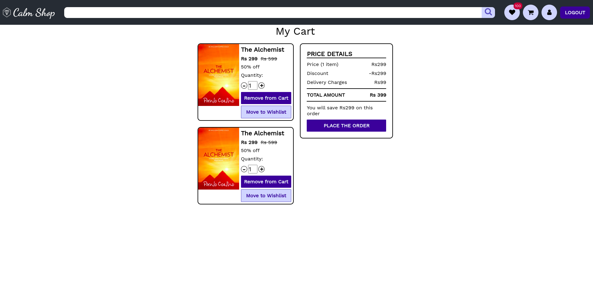

### [Checkout Page](https://ecomm-screens.netlify.app/pages/checkout.html)
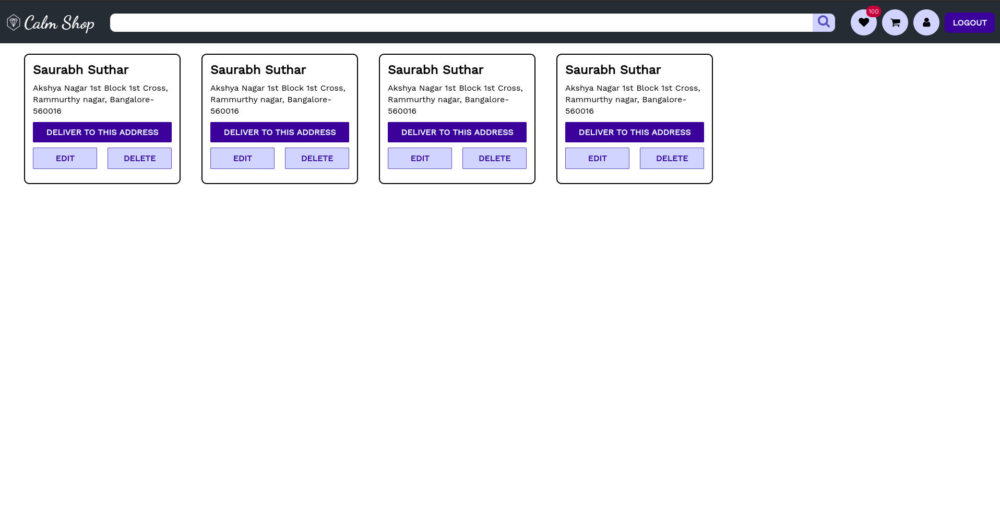

### [Forgot Passwrod Page](https://ecomm-screens.netlify.app/pages/forgot-password.html)

### [Home Page](https://ecomm-screens.netlify.app/)
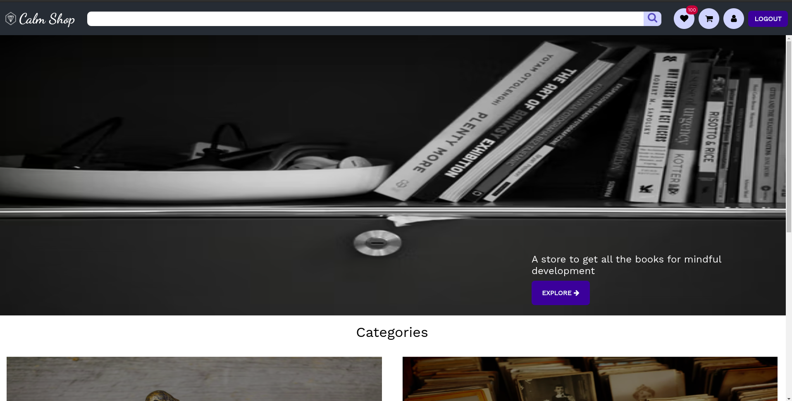
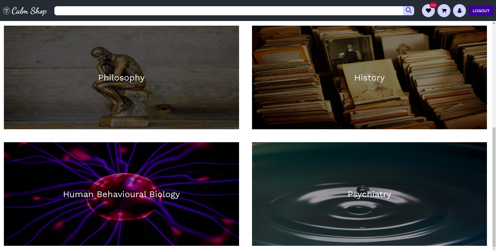

### [Login Page](https://ecomm-screens.netlify.app/pages/login.html)
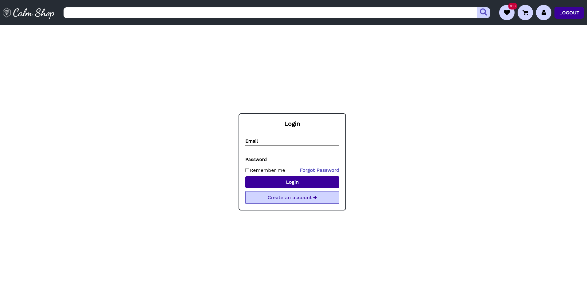

### [Logout Page](https://ecomm-screens.netlify.app/pages/logout.html)
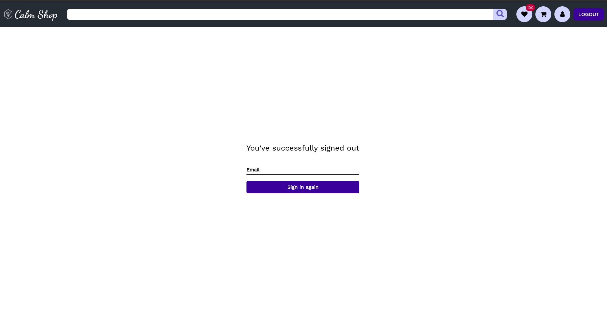

### [Products Page](https://ecomm-screens.netlify.app/pages/products.html)
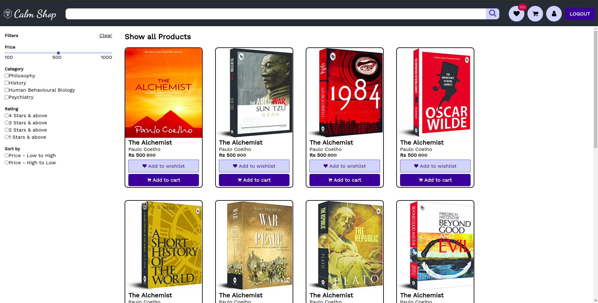
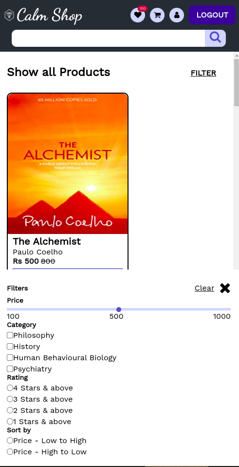

### [Signup Page](https://ecomm-screens.netlify.app/pages/signup.html)
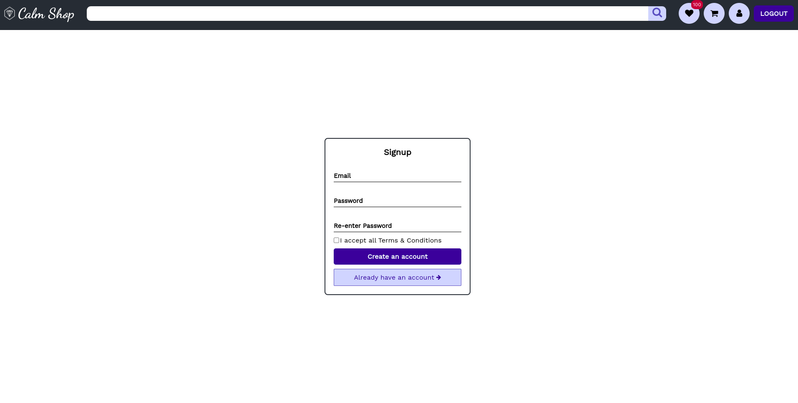

### [Single Product Page](https://ecomm-screens.netlify.app/pages/singleProductPage.html)
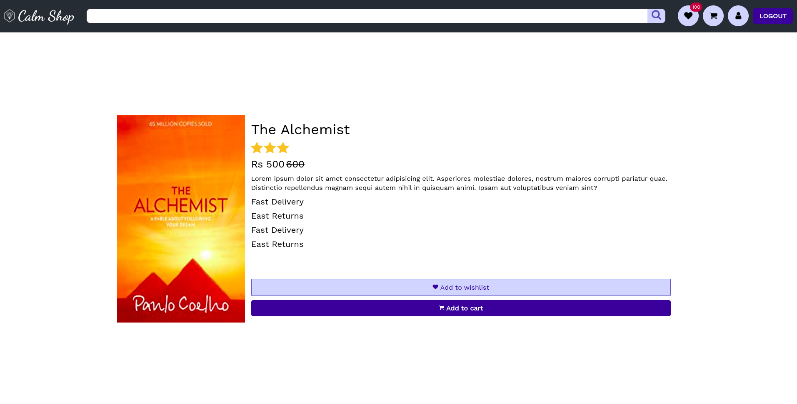

### [User Profile Page](https://ecomm-screens.netlify.app/pages/user-profile.html)
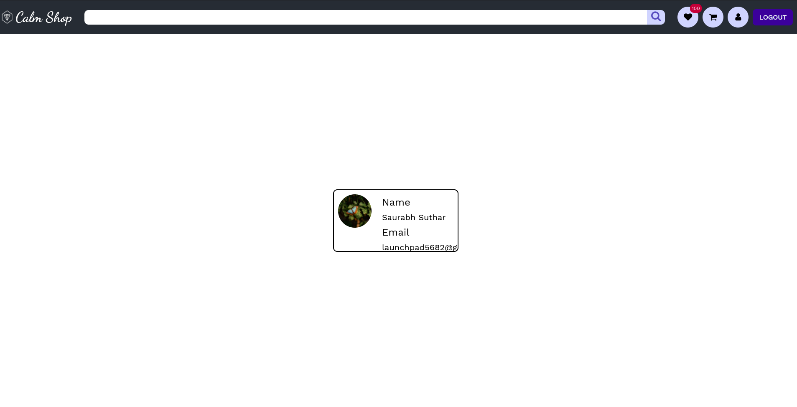

### [Wishlist Page](https://ecomm-screens.netlify.app/pages/wishlist.html)
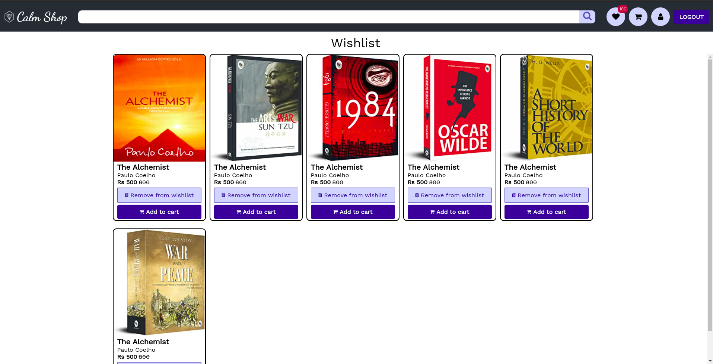